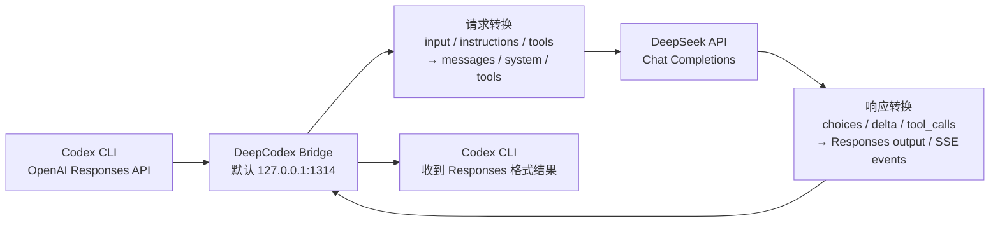

# DeepCodex

让 Codex CLI 使用 DeepSeek 模型。

Codex CLI 使用 OpenAI Responses API 协议，DeepSeek 使用 Chat Completions API。DeepCodex 会在本机启动一个轻量 Bridge，把两边协议自动转换，并帮你一键切换 Codex 配置。

项目地址：https://github.com/miloce/DeepCodex

下载地址：https://github.com/miloce/DeepCodex/releases

## 适合谁

- 想在 Codex CLI 里使用 DeepSeek 的用户
- 不想手动改 Codex 配置的用户
- 只想填一次 DeepSeek API Key，然后一键切换的用户

## 快速开始：下载应用程序

如果你只是使用，不想安装开发环境，推荐直接下载 GitHub Releases 里的应用程序。

1. 打开本仓库的 Releases：https://github.com/miloce/DeepCodex/releases
2. 选择最新版本
3. 下载对应系统的压缩包：

```text
Windows: deepcodex-app-windows.zip
macOS:   deepcodex-app-macos.zip
Linux:   deepcodex-app-linux.zip
```

4. 解压后运行：

```text
Windows: deepcodex.exe
macOS/Linux: deepcodex
```

首次运行会让你输入 `DeepSeek API Key`。

## 接口转换流程



## 快速开始：源码运行

如果你是开发者，或者想直接从源码运行：

### 1. 安装 Node.js

请先安装 Node.js 18 或更高版本。

验证：

```bash
node --version
npm --version
```

### 2. 安装依赖

在项目目录中执行：

```bash
npm install
```

### 3. 启动菜单

```bash
npm start
```

你会看到：

```text
1. 使用 DeepSeek
2. 使用原配置
3. 修改 DeepSeek API Key
4. 退出
```

## 菜单说明

### 1. 使用 DeepSeek

会自动完成：

- 获取 DeepSeek `/models`
- 选择远程返回的第一个模型
- 生成 Codex 可识别的 DeepSeek 模型目录
- 修改 Codex 配置，但保留 Codex Desktop 的原聊天列表分组
- 启动本地 Bridge

完成后，你正常打开 Codex CLI 即可使用 DeepSeek。

### 2. 使用原配置

会自动完成：

- 恢复 Codex 原来的配置
- 关闭本地 Bridge

适合你想切回 OpenAI / 原 Codex 配置时使用。

### 3. 修改 DeepSeek API Key

重新保存 DeepSeek API Key。

### 4. 退出

退出 DeepCodex 菜单。

如果当前已经切到 DeepSeek，下次再打开 DeepCodex 时，会自动启动 Bridge。

如果当前是原配置，DeepCodex 不会启动 Bridge。

## 常用命令

```bash
npm start              # 打开菜单
npm run cli            # 同上
node src/cli.js status # 查看当前状态
node src/cli.js on     # 直接切到 DeepSeek
node src/cli.js off    # 直接切回原配置
```

只启动 Bridge：

```bash
npm run bridge
```

构建：

```bash
npm run build          # 生成 Node.js 发布包
npm run build:app      # 生成当前系统的单文件应用程序
```

## Bridge 信息

本地 Bridge 默认监听：

```text
http://127.0.0.1:1314
```

如果 `1314` 被占用，DeepCodex 会自动选择一个空闲端口，并把 Codex 配置里的 `custom` provider 地址改成实际端口。

接口：

```text
GET  /health
GET  /v1
GET  /v1/models
POST /v1/responses
```

Codex 会通过这个本地地址访问 DeepSeek。

浏览器打开 `http://127.0.0.1:1314/v1` 只用于检查 Bridge 是否已经启动。只有选择 `使用 DeepSeek` 后，Bridge 才会运行；如果当前是 `原配置`，这个地址不会打开。

## Codex 配置说明

DeepCodex 会自动备份并修改：

```text
~/.codex/config.toml
```

切到 DeepSeek 时会写入类似配置：

```toml
model = "deepseek-v4-flash"
model_provider = "custom"
model_catalog_json = "C:\\Users\\you\\.codex\\deepcodex.models.json"

# >>> deepcodex-deepseek
[model_providers.custom]
name = "DeepSeek"
base_url = "http://127.0.0.1:1314/v1"
wire_api = "responses"
requires_openai_auth = true
experimental_bearer_token = "sk-local-proxy"
# <<< deepcodex-deepseek
```

切回原配置时，会恢复备份。

Codex 的模型列表入口是 `model_catalog_json` 指向的 `deepcodex.models.json`。`models_cache.json` 只是 Codex 自己维护的缓存，可能会被刷新覆盖，DeepCodex 不把它当成唯一来源。

## 常见问题

### 1. 为什么要保持 DeepCodex 运行？

Codex 请求会先到本地 Bridge，再由 Bridge 转发到 DeepSeek。使用 DeepSeek 模式时，Bridge 需要保持运行。

### 2. 切回原配置后还会占用端口吗？

不会。选择 `使用原配置` 后，DeepCodex 会关闭 Bridge。

### 3. 打开 http://127.0.0.1:1314/v1 提示拒绝连接怎么办？

说明 Bridge 没有运行。先打开 DeepCodex，配置 DeepSeek API Key，然后选择 `使用 DeepSeek`。

如果 `1314` 被其他程序占用，DeepCodex 会自动换一个空闲端口，并把 Codex 配置改成实际端口。

### 4. 为什么切到 DeepSeek 后聊天记录不见了？

DeepCodex 使用 `model_provider = "custom"`，Codex Desktop 可能会按 provider 分组显示线程。选择 `使用原配置` 后会恢复原来的配置和聊天分组。

### 5. 为什么 Codex 前端只显示“自定义”或模型为空？

先完全退出并重新打开 Codex Desktop。Codex 的模型列表来自 `~/.codex/config.toml` 里的 `model_catalog_json`，不是稳定来自 `models_cache.json`。DeepCodex 会写绝对路径，避免 Codex 在不同工作目录下找不到模型文件。

### 6. 模型是不是写死的？

默认模型目录使用内置的 Codex 兼容模板，包含：

```text
deepseek-v4-flash
deepseek-v4-pro
```

DeepCodex 启动时仍会请求 DeepSeek `/models` 验证可用性，然后写入本地 `deepcodex.models.json` 和 `models_cache.json`，这样 Codex 界面里也能看到模型名称。

### 7. API Key 保存在哪里？

源码运行时会写到项目 `.env` 和系统环境变量。

单文件应用运行时会写到用户应用数据目录：

```text
Windows: %APPDATA%\DeepCodex
```

## 版权

Copyright (c) miloce

项目地址：https://github.com/miloce/DeepCodex

下载地址：https://github.com/miloce/DeepCodex/releases
